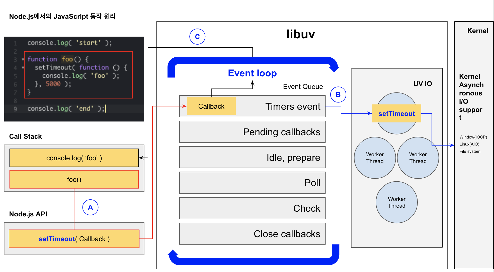

# Node.js

## 1. Node.js 란?

<pre>
JavaScript로 확장성 있는 네트워크 애플리케이션 개발에 사용되는 소프트웨어 플랫폼이다. (출저 wiki)
</pre>

기존 JavaScript는 브라우저에서 웹 페이지가 동작하는 것 즉, Front-End의 영역이었지만, Node.js로 Back-End 개발이 가능하다.

Node.js를 서버 구축 등의 코드를 실행할 수 있게 해주는 런타임 환경(Runtime Environment)* 이라고도 하는데, 이 표현이 정확한 듯 하다.

* 런타임 환경(Runtime Environment)   
컴퓨터가 실행되는 동안 프로세스나 프로그램을 위한 SW 서비스를 제공하는 가상 머신의 상태, OS 자체에 속하는 경우도 있고 OS에서 동작하는 SW를 뜻할 수도 있다.(출저: wiki)

* 한 마디로, 프로그래밍 언어가 구동되는 환경이다. JavaScript의 측면에서 런타임은 Node.js(혹은 Browser)라는 뜻

* Node.js는 단순한 서버가 아니라, JavaScript 실행 환경(런타임)으로 인식하는게 맞다고 생각한다.

일반적으로 php나 java 같은 언어를 사용하기 위해서는 Apache, NginX, Tomcat 같은 서버가 필요한데, Node.js는 내장 HTTP 라이브러리가 있어 별도의 웹 서버 없이 동작하는 것이 가능하다.

---

## 2. Node.js 핵심구조

<pre>V8 Engine + Libuv library</pre>

### 2.1. V8 javascript engine

구글에서 개발한 오픈소스 JavaScript 엔진   
V8 엔진을 통해 Node.js는 JavaScript를 인식한다.(크롬 브라우저도 JavaScript 처리 엔진으로 V8을 사용함)

### 2.2. Libuv library

Non-blocking I/O 처리를 위해 이벤트 루프를 제공한다.   
한마디로 Node.js의 비동기 처리는 이 라이브러리를 통해 이루어지고 있다.

(Node.js에서는 이 Non-blocking 개념이 꽤나 중요한 것 같다.)

---

## 3. 싱글 스레드? Non-blocking? 이벤트 루프?

여러 글을 읽어보고 종합해보자면
<pre>
Node.js는 싱글 스레드 기반 Non-blocking I/O를 지원하는 런타임 환경
</pre>

런타임 환경은 알겠는데, 싱글 스레드가 어쨌고 Non-blocking은 무슨 소리인지 이해가 안가더라.

### 3.1. 싱글 스레드**

** 스레드란? 기본적으로 CPU의 코어 당 한 번에 업무를 담당하여 처리할 수 있는데, 이 코어를 논리적으로 2개로 나눈 기술이 Intel의 Hyper Threading 기술이다.

** 예를 들어, 4개의 코어를 가지고 있는 CPU가 있다면, Hyper Threading 기술로 8개의 코어가 있는 것처럼 동작하는 것이다.(OS에서도 8개의 코어가 있는 것으로 인식한다)

** Amd는 SMT라고 부른다.

Node.js는 하나의 스레드를 이용하여 일을 처리한다.

멀티 스레드의 단점
1. **물리적 스레드 수의 한계**로인한 동시로 처리할 수 있는 서비스의 수
2. 각 스레드 간의 작업 처리 순서와 공유 자원에 대한 접근 컨트롤을 해주기 위한 **동기화** 작업
3. IO*** 효율, 클라이언트에 할당된 스레드에서 IO 호출 시 할당된 스레드는 대기 상태(wait)로 빠지게 된다.

***Input/Output(입출력), 그래서 IO라고 하다.

엄밀히 따지면 비동기 처리를 하기 위해서 다른 스레드를 사용하기 때문에 싱글 스레드는 아니라고 한다.

### 3.2. Non-blocking I/O

이전 코드 블럭(작업)이 끝날때까지 대기한 후 바로 다음 작업으로 진행하는 방식을 동기(Synchronous) / Blocking 방식이라고 하는데,

비동기(Asynchronous) / Non-blocking은 이전 코드 블럭(작업)이 완료될때까지 기다리지 않고 바로 다음 작업을 수행한다. 비동기(Asynchronous) 처리와 비슷한 개념이다.

아래는 Blcoking 방식과 Non-blocking 방식을 처리하는 예제이다.

> console.log( 'start' );   
function foo() {   
    setTimeout( function () {   
        console.log( 'foo' );
    }, 5000 );
}   
foo();   
console.log( 'end' );

setTimeout은 첫번째 인자로 콜백함수를 받고 두번째 인자로 시간(1000분의 1초)을 받는다.

위의 코드가 Blocking(동기) 방식으로 실행된다면, 첫번째 console.log( 'start' )의 작업이 끝난 후 foo 함수를 정의하고 foo함수의 호출이 끝나면 console.log( 'end' ); 가 실행될 것이다. 결과는 아래와 같다.

> start   
> foo   
> end

콘솔 창에 start가 실행되고, 5초 뒤 foo가 실행된 후 마지막으로 end가 실행된다.
하지만 자바스크립트는 Non-blocking 방식의 프로그래밍 언어이기 때문에 아래와 같이 출력된다.

> start   
> end   
> foo

Non-blocking(비동기)은 첫번째 console.log( 'start' ); 코드 블럭을 호출한 후 작업이 끝날때까지 기다리지 않고 바로 다음 foo 함수를 정의한다. foo 함수가 호출된 후 마찬가지로 작업이 끝날때까지 기다리지 않고 console.log( 'end' ); 코드 블럭을 호출한 후 foo 함수가 작업이 끝나면 console.log( 'foo' );를 호출한다.

호출된 함수는 V8엔진의 Call-Stack의 스택으로 쌓이게 된다.(참고로 크롬 브라우저의 개발자 도구에 자바스크립트 디버깅 툴에 보면 Call Stack을 확인할 수 있다.)

위의 코드가 Call-Stack에 쌓이게 되는 순서는 아래와 같다.

Call-Stack
- Step1: console.log( 'start' )
- Step2: foo()
- Step3: foo(), console.log( 'end' )
- Step3: foo()
- Step4: (호출 완료)

### 3.3. Event-loop(이벤트 루프)

자바스크립트는 신기하게도 싱글 스레드 기반이지만 여러작업을 동시에 처리하는 Non-blocking / 비동기(Asynchronous) 방식으로 프로그래밍을 하는데 이를 가능케 해주는 것이 Event-loop 이다.

A. 비동기 함수(setTimeout) 처리를 위해 Event-loop 생성   
B. UV_IO를 통해 커널에서 비동기 함수를 처리한다.   
C. 비동기 함수 처리가 완료되면, Callback 함수는 Event-loop를 통해 콜스택에서 처리한다.

이벤트 루프 요약

비동기 함수는 UV_IO를 통해 커널(OS에서 지원하는 비동기 처리 시스템)에 넘겨주고, 작업이 끝나면 콜백 함수를 다시 콜스택으로 넘겨주는 역활을 한다.